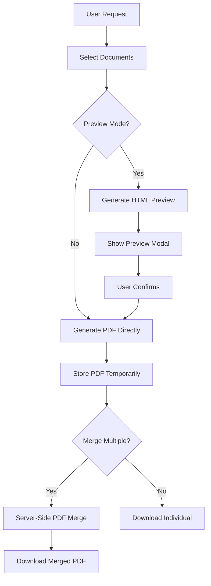
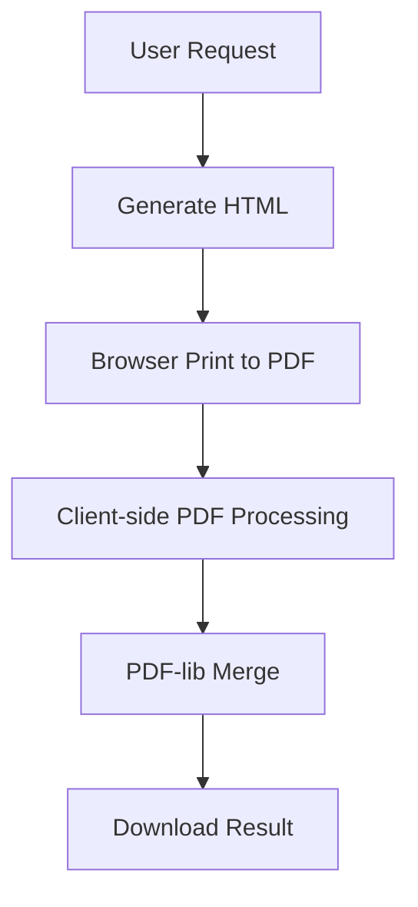
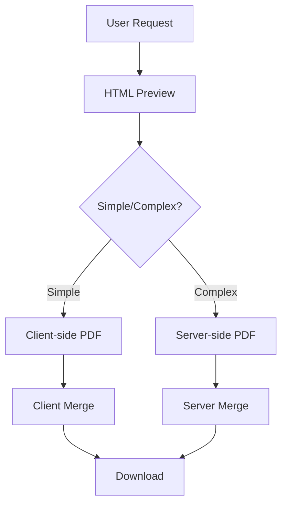

# Sistem PDF untuk Medical Records - Proposal & Implementasi

## 📋 Overview

Dokumen ini menjelaskan berbagai pendekatan untuk implementasi sistem PDF yang memungkinkan:
- ✅ Preview individual dokumen sebelum penggabungan
- ✅ Seleksi dokumen yang ingin digabung
- ✅ Generate PDF individual
- ✅ Merge multiple PDF files
- ✅ Download hasil akhir

---

## 🎯 Requirements Analysis

### Functional Requirements
1. **Individual PDF Generation**
   - Generate PDF per jenis dokumen (Laboratorium, Radiologi, dll)
   - Preview sebelum download/merge
   
2. **Selective Document Merging**
   - Checkbox selection untuk dokumen yang ingin digabung
   - Urutan dokumen berdasarkan sequence klik user
   - Drag & drop reordering (optional)
   - Visual indicator urutan dokumen
   
3. **PDF Merging System**
   - Merge multiple PDF files menjadi satu
   - Maintain quality dan formatting
   
4. **User Experience**
   - Preview modal untuk setiap dokumen
   - Progress indicator saat generate/merge
   - Download options (individual/merged)

---

## 🔧 Technical Approaches

### Approach 1: PDF-First with Server-Side Merge ⭐ **RECOMMENDED**



**Tech Stack:**
- **Frontend**: React/TypeScript dengan PDF.js untuk preview
- **Backend**: Laravel dengan DomPDF/mPDF untuk generation + PDFtk/FPDI untuk merging
- **Storage**: Temporary file storage untuk PDF files

**Pros:**
- ✅ High quality output
- ✅ Server-side processing (reliable)
- ✅ Professional PDF output
- ✅ Can handle complex layouts
- ✅ Better for large documents

**Cons:**
- ❌ Requires server resources
- ❌ Need temporary file management
- ❌ Additional PDF library dependency

### Approach 2: Client-Side with PDF-lib



**Tech Stack:**
- **Frontend**: React + PDF-lib + html2canvas/puppeteer
- **Backend**: Minimal - hanya serve data
- **Processing**: Client-side PDF generation dan merging

**Pros:**
- ✅ No server load untuk PDF processing
- ✅ Real-time preview
- ✅ Fast untuk simple documents
- ✅ No temporary file management

**Cons:**
- ❌ Quality limitations
- ❌ Browser compatibility issues
- ❌ Limited formatting control
- ❌ Performance issues untuk large files

### Approach 3: Hybrid Approach



**Tech Stack:**
- **Frontend**: React dengan fallback options
- **Backend**: Laravel dengan conditional processing
- **Decision Logic**: Auto-detect complexity atau user choice

---

## 🏗️ Recommended Implementation Plan

### Phase 1: Individual PDF Generation

```php
// Controller Structure
class MedicalRecordPDFController extends Controller 
{
    public function generateLabPDF($pengajuanId) 
    {
        // Generate Lab PDF
    }
    
    public function generateRadiologiPDF($pengajuanId) 
    {
        // Generate Radiologi PDF
    }
    
    public function previewDocument($type, $pengajuanId)
    {
        // Return HTML preview
    }
}
```

```typescript
// Frontend Structure
interface PDFDocument {
    id: string;
    type: 'laboratorium' | 'radiologi' | 'farmasi';
    title: string;
    isSelected: boolean;
    selectionOrder: number | null; // Urutan berdasarkan klik
    previewUrl: string;
    pdfUrl: string;
}

const PDFManager: React.FC = () => {
    const [documents, setDocuments] = useState<PDFDocument[]>([]);
    const [selectedDocs, setSelectedDocs] = useState<string[]>([]);
    const [selectionCounter, setSelectionCounter] = useState(0);
    
    // Preview, Generate, Merge functions with ordering
};
```

### Phase 2: Preview System

```tsx
// Preview Modal Component
const DocumentPreviewModal: React.FC<{
    document: PDFDocument;
    isOpen: boolean;
    onClose: () => void;
    onConfirm: () => void;
}> = ({ document, isOpen, onClose, onConfirm }) => {
    return (
        <Modal isOpen={isOpen}>
            <div className="preview-container">
                {/* HTML Preview */}
                <iframe src={document.previewUrl} />
                
                <div className="actions">
                    <Button onClick={onClose}>Cancel</Button>
                    <Button onClick={onConfirm}>Add to Merge</Button>
                </div>
            </div>
        </Modal>
    );
};
```

### Phase 3: PDF Merging

```php
// Server-side PDF Merger
use setasign\Fpdi\Fpdi;

class PDFMergerService 
{
    public function mergePDFs(array $pdfPaths): string 
    {
        $pdf = new Fpdi();
        
        foreach ($pdfPaths as $path) {
            $pageCount = $pdf->setSourceFile($path);
            
            for ($i = 1; $i <= $pageCount; $i++) {
                $pdf->AddPage();
                $tpl = $pdf->importPage($i);
                $pdf->useTemplate($tpl);
            }
        }
        
        $outputPath = storage_path('app/temp/merged_' . uniqid() . '.pdf');
        $pdf->Output($outputPath, 'F');
        
        return $outputPath;
    }
}
```

### Phase 4: Complete User Interface with Document Ordering

```tsx
const PDFDocumentSelector: React.FC = () => {
    const [selectionOrder, setSelectionOrder] = useState<string[]>([]);
    
    const toggleDocument = (docId: string) => {
        setDocuments(prev => prev.map(doc => {
            if (doc.id === docId) {
                if (doc.isSelected) {
                    // Unselecting - remove from order
                    setSelectionOrder(order => order.filter(id => id !== docId));
                    return { ...doc, isSelected: false, selectionOrder: null };
                } else {
                    // Selecting - add to order
                    const newOrder = selectionOrder.length + 1;
                    setSelectionOrder(order => [...order, docId]);
                    return { ...doc, isSelected: true, selectionOrder: newOrder };
                }
            }
            return doc;
        }));
    };

    const reorderDocument = (dragIndex: number, hoverIndex: number) => {
        const newOrder = [...selectionOrder];
        const draggedItem = newOrder[dragIndex];
        newOrder.splice(dragIndex, 1);
        newOrder.splice(hoverIndex, 0, draggedItem);
        setSelectionOrder(newOrder);
        
        // Update selection order numbers
        setDocuments(prev => prev.map(doc => {
            const orderIndex = newOrder.indexOf(doc.id);
            return orderIndex >= 0 ? { ...doc, selectionOrder: orderIndex + 1 } : doc;
        }));
    };

    const getSelectedDocuments = () => {
        return selectionOrder
            .map(id => documents.find(doc => doc.id === id))
            .filter(Boolean) as PDFDocument[];
    };

    return (
        <div className="pdf-selector">
            <h3>Select Documents to Include</h3>
            
            {documents.map(doc => (
                <div key={doc.id} className="document-item" 
                     data-selected={doc.isSelected}>
                    <Checkbox 
                        checked={doc.isSelected}
                        onChange={() => toggleDocument(doc.id)}
                    />
                    
                    {doc.isSelected && (
                        <span className="order-badge">#{doc.selectionOrder}</span>
                    )}
                    
                    <span className="doc-title">{doc.title}</span>
                    
                    <Button 
                        variant="outline" 
                        onClick={() => previewDocument(doc)}
                    >
                        Preview
                    </Button>
                    
                    <Button 
                        variant="outline"
                        onClick={() => downloadIndividual(doc)}
                    >
                        Download
                    </Button>
                </div>
            ))}
            
            {selectionOrder.length > 0 && (
                <div className="selected-order">
                    <h4>Merge Order:</h4>
                    <div className="order-list">
                        {getSelectedDocuments().map((doc, index) => (
                            <div key={doc.id} className="order-item" 
                                 draggable onDragStart={() => setDragIndex(index)}>
                                <span>#{index + 1}</span>
                                <span>{doc.title}</span>
                                <Button size="sm" onClick={() => toggleDocument(doc.id)}>
                                    Remove
                                </Button>
                            </div>
                        ))}
                    </div>
                </div>
            )}
            
            <div className="bulk-actions">
                <Button 
                    onClick={() => mergeSelected(getSelectedDocuments())}
                    disabled={selectionOrder.length < 2}
                >
                    Merge Selected ({selectionOrder.length})
                </Button>
            </div>
        </div>
    );
};
```

---

## ⚡ Performance & Resource Management Analysis

### Temporary Files vs On-Demand Generation

#### Approach A: On-Demand Generation (No Temporary Files) ⭐ **RECOMMENDED**

```php
class PDFController extends Controller 
{
    public function generatePreview($type, $pengajuanId)
    {
        // Generate HTML preview on-the-fly
        $data = $this->getDocumentData($type, $pengajuanId);
        return view("pdf.{$type}", compact('data'));
    }
    
    public function generatePDF($type, $pengajuanId) 
    {
        // Generate PDF on-demand for download/merge
        $data = $this->getDocumentData($type, $pengajuanId);
        $pdf = PDF::loadView("pdf.{$type}", compact('data'));
        
        // Return as stream for immediate use
        return $pdf->output();
    }
    
    public function mergePDFs(Request $request)
    {
        $selectedTypes = $request->input('types'); // ['laboratorium', 'radiologi']
        $pengajuanId = $request->input('pengajuan_id');
        
        $merger = new PDFMerger();
        
        foreach ($selectedTypes as $type) {
            $pdfContent = $this->generatePDF($type, $pengajuanId);
            $merger->addPDFFromString($pdfContent);
        }
        
        return response($merger->merge(), 200, [
            'Content-Type' => 'application/pdf',
            'Content-Disposition' => 'attachment; filename="medical-records.pdf"'
        ]);
    }
}
```

**Pros:**
- ✅ **No disk space usage** - semua in-memory
- ✅ **No cleanup required** - tidak ada file temporary
- ✅ **Always fresh data** - selalu data terbaru
- ✅ **Simpler architecture** - tidak perlu file management
- ✅ **Better security** - tidak ada file tersisa di server

**Cons:**
- ❌ **Higher CPU usage** - regenerate setiap kali
- ❌ **Slower untuk multiple preview** - tidak ada caching
- ❌ **Memory usage spike** - saat merge multiple PDF

#### Approach B: Smart Caching with TTL

```php
class PDFCacheService 
{
    protected $cacheTimeout = 1800; // 30 minutes
    
    public function getCachedPDF($type, $pengajuanId) 
    {
        $cacheKey = "pdf_{$type}_{$pengajuanId}";
        $cachePath = storage_path("app/pdf-cache/{$cacheKey}.pdf");
        
        // Check if cache exists and is still valid
        if (file_exists($cachePath) && 
            (time() - filemtime($cachePath)) < $this->cacheTimeout) {
            return file_get_contents($cachePath);
        }
        
        // Generate new PDF
        $pdfContent = $this->generateFreshPDF($type, $pengajuanId);
        
        // Cache for future use
        file_put_contents($cachePath, $pdfContent);
        
        return $pdfContent;
    }
    
    public function cleanupExpiredCache() 
    {
        $cacheDir = storage_path('app/pdf-cache');
        $files = glob("{$cacheDir}/*.pdf");
        
        foreach ($files as $file) {
            if ((time() - filemtime($file)) > $this->cacheTimeout) {
                unlink($file);
            }
        }
    }
}
```

**Pros:**
- ✅ **Faster repeated access** - cached PDF
- ✅ **Reduced CPU usage** - tidak regenerate terus
- ✅ **Auto cleanup** - dengan TTL system
- ✅ **Configurable cache time**

**Cons:**
- ❌ **Disk space usage** - temporary files
- ❌ **Stale data risk** - data bisa outdated
- ❌ **Cleanup complexity** - perlu scheduled job
- ❌ **Additional file management**

### Performance Comparison

| Aspect | On-Demand | Smart Cache | Pure Temporary |
|--------|-----------|-------------|----------------|
| **Initial Load** | Medium | Slow | Slow |
| **Repeated Access** | Medium | Fast | Fast |
| **Memory Usage** | Medium | Low | Low |
| **CPU Usage** | High | Low | Low |
| **Disk Usage** | None | Medium | High |
| **Data Freshness** | Always Fresh | TTL-based | Manual |
| **Maintenance** | None | Scheduled Cleanup | Manual Cleanup |

### Resource Usage Analysis

```typescript
// Estimated resource usage for medical records

// Scenario: 10 dokumen types, 100 pengajuan per day, 5 users concurrent

// On-Demand Approach:
// - CPU: High during generation (2-3 seconds per PDF)
// - Memory: 10-50MB per PDF generation
// - Disk: 0MB
// - Network: Direct stream to user

// Smart Cache Approach:
// - CPU: Low after initial generation
// - Memory: 5-10MB per request
// - Disk: ~2MB per cached PDF × 1000 PDFs = 2GB max
// - Network: Fast delivery from cache

// Temporary File Approach:
// - CPU: Low after generation
// - Memory: 5-10MB per request  
// - Disk: Unlimited growth without cleanup
// - Network: Fast delivery
```

### Recommended Strategy

**For Medical Records System: Use On-Demand Generation** karena:

1. **Medical data changes frequently** - lab results, radiologi bisa diupdate
2. **Preview usage pattern** - user biasanya preview sekali saja
3. **Security compliance** - no sensitive data left on disk
4. **Simpler deployment** - no background jobs untuk cleanup
5. **Resource efficiency** - PDF generation ~2-3 detik acceptable untuk medical records

```php
// Optimized On-Demand Implementation
class OptimizedPDFController extends Controller 
{
    public function generateBundle(Request $request)
    {
        $types = $request->input('document_types'); // ordered array
        $pengajuanId = $request->input('pengajuan_id');
        
        // Use streaming untuk large merges
        return response()->streamDownload(function() use ($types, $pengajuanId) {
            $merger = new PDFMerger();
            
            foreach ($types as $type) {
                // Generate each PDF in sequence to manage memory
                $pdfContent = $this->generateSinglePDF($type, $pengajuanId);
                $merger->addPDFFromString($pdfContent);
                
                // Free memory after each addition
                unset($pdfContent);
                gc_collect_cycles();
            }
            
            echo $merger->merge();
        }, 'medical-records-' . date('Y-m-d-H-i-s') . '.pdf');
    }
    
    private function generateSinglePDF($type, $pengajuanId) 
    {
        // Optimized query - hanya ambil data yang diperlukan
        $data = DB::table($this->getTableName($type))
                  ->where('pengajuan_klaim_id', $pengajuanId)
                  ->select($this->getRequiredFields($type))
                  ->get();
        
        $pdf = PDF::loadView("pdf.{$type}", compact('data'))
                  ->setPaper('a4')
                  ->setOptions(['isPhpEnabled' => true]);
        
        return $pdf->output();
    }
}
```

---

## 📚 Required Libraries

### Backend (Laravel)
```json
{
    "require": {
        "dompdf/dompdf": "^2.0",
        "setasign/fpdi": "^2.3",
        "tecnickcom/tcpdf": "^6.6"
    }
}
```

### Frontend (React)
```json
{
    "dependencies": {
        "react-pdf": "^7.0.0",
        "pdf-lib": "^1.17.0",
        "@react-pdf/renderer": "^3.0.0"
    }
}
```

---

## 🗂️ File Structure

```
app/
├── Http/Controllers/PDF
│   ├── PDFController.php
│   └── MedicalRecordPDFController.php
├── Services/
│   ├── PDFGeneratorService.php
│   └── PDFMergerService.php
└── Models/PDF
    └── PDFDocument.php

resources/
├── views/pdf/
│   ├── laboratorium.blade.php
│   ├── radiologi.blade.php
│   └── layouts/
│       └── pdf-base.blade.php
└── js/components/
    ├── PDFPreview/
    ├── DocumentSelector/
    └── PDFManager/

storage/
├── app/
│   ├── pdfs/
│   │   ├── individual/
│   │   └── merged/
│   └── temp/
└── logs/
```

---

## 🔄 Workflow Implementation

### 1. Document Selection Flow
```typescript
const selectDocumentWorkflow = async () => {
    // 1. Load available document types
    const availableTypes = await getAvailableDocumentTypes(pengajuanId);
    
    // 2. User selects document types
    const selectedTypes = await showDocumentSelector(availableTypes);
    
    // 3. Generate preview for each selected type
    const previews = await Promise.all(
        selectedTypes.map(type => generatePreview(type, pengajuanId))
    );
    
    // 4. Show preview modal for confirmation
    const confirmedDocs = await showPreviewModal(previews);
    
    return confirmedDocs;
};
```

### 2. PDF Generation & Merge Flow
```typescript
const generateAndMergeFlow = async (selectedDocs: PDFDocument[]) => {
    // 1. Generate individual PDFs
    setStatus('Generating individual documents...');
    const pdfPaths = await Promise.all(
        selectedDocs.map(doc => generatePDF(doc.type, doc.id))
    );
    
    // 2. Merge PDFs if multiple selected
    if (pdfPaths.length > 1) {
        setStatus('Merging documents...');
        const mergedPath = await mergePDFs(pdfPaths);
        return mergedPath;
    }
    
    return pdfPaths[0];
};
```

---

## 🎨 UI/UX Considerations

### 1. Progressive Enhancement
- Start with basic functionality
- Add advanced features incrementally
- Maintain fallback options

### 2. Performance Optimization
- Lazy load PDF previews
- Cache generated PDFs temporarily
- Progress indicators for long operations
- Background processing for large merges

### 3. Error Handling
- Clear error messages
- Retry mechanisms
- Graceful degradation
- User-friendly timeout handling

---

## 🚀 Migration Strategy

### Week 1: Foundation
- [ ] Setup PDF libraries
- [ ] Create basic PDF templates
- [ ] Implement individual document generation

### Week 2: Preview System
- [ ] Build preview modal component
- [ ] Integrate with existing UI
- [ ] Add document selection interface

### Week 3: Merging System
- [ ] Implement PDF merger service
- [ ] Add bulk operations
- [ ] Testing and optimization

### Week 4: Polish & Deploy
- [ ] Error handling improvements
- [ ] Performance optimization
- [ ] User testing and feedback
- [ ] Production deployment

---

## 💡 Alternative Suggestions

### Option A: Third-party Service
- **Pros**: Professional quality, no maintenance
- **Cons**: Cost, external dependency
- **Services**: PDFShift, HTML/CSS to PDF API

### Option B: Microservice Architecture
- **Pros**: Scalable, isolated processing
- **Cons**: Complex setup, infrastructure cost
- **Tech**: Docker container dengan headless browser

### Option C: Queue-based Processing
- **Pros**: Better performance, background processing
- **Cons**: Complex implementation, requires queue system
- **Tech**: Laravel Queues + Redis/Database

---

## 🎯 Recommendation

**Go with Approach 1 (PDF-First with Server-Side Merge)** karena:

1. **Quality**: Professional PDF output
2. **Reliability**: Server-side processing lebih stabil
3. **Maintenance**: Easier to debug dan maintain
4. **Scalability**: Can handle complex documents
5. **User Experience**: Consistent preview dan output quality

**Implementation Priority:**
1. Start dengan simple individual PDF generation
2. Add preview functionality
3. Implement selection UI
4. Add PDF merging capabilities
5. Polish dan optimization

Apakah pendekatan ini sesuai dengan kebutuhan Anda? Ada aspek tertentu yang ingin dibahas lebih detail?
